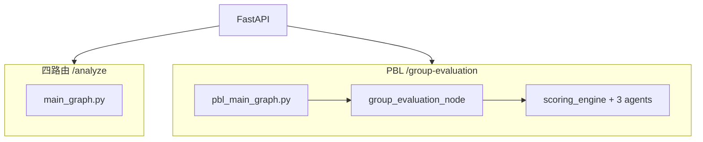

# empty-window · 教育智能体 + PBL 小组项目评价

LangGraph 多 Agent 教育评估平台，整合 preview-agent 的 **12 维 PBL 小组项目评价** 能力。

## 两种评价模式

| 模式 | API | 分数尺度 | 适用场景 |
|------|-----|----------|----------|
| **四路由** | `POST /analyze` | 0–100 | 理论 / 实践 / 数据 / 文献作业 |
| **PBL 小组项目** | `POST /group-evaluation` | 1.0–5.0 | 整份项目报告（12 维 + 3 一级） |

前端：Copilot 聊天 Tab + **小组项目评价** Tab + 同伴互评。

## 快速启动

```powershell
# 1. 环境
cd empty-window
python -m venv venv
.\venv\Scripts\pip install -r requirements.txt
# 在项目根目录 .env 设置 OPENAI_API_KEY

# 2. 后端
cd backend
python -m uvicorn api.main:app --host 127.0.0.1 --port 8000

# 3. 前端
cd frontend
npm install
npm run dev
```

浏览器：`http://localhost:5173`

## PBL 配置（环境变量）

| 变量 | 默认 | 说明 |
|------|------|------|
| `PBL_SCORING_TIMES` | `3` | 每维度 LLM 采样次数（生产建议 3；测试可设 1） |
| `PBL_RAG_TOP_K` | `8` | 每维度 RAG 检索数 |
| `PBL_REVIEW_ROUNDS` | `5` | 完整 PBL 审核重评轮数 |
| `PBL_CACHE_ENABLED` | `true` | 同报告 hash 结果缓存 |
| `PBL_CACHE_TTL_HOURS` | `168` | 缓存有效期（小时） |

## 主要目录

```
agents/group_project/     # 三评分 Agent + Review + summary + primary
  pbl_config.py             # 统一默认配置
  scoring_engine.py         # 共享评分引擎
  scoring_models.py         # LLM 客户端与 Pydantic 模型
  scoring_utils.py          # 片段抽取 / RAG / 统计工具
graphs/group_project_graph.py
pbl_main_graph.py           # PBL 主图（记忆 → 评价 → 持久化）
backend/api/main.py         # FastAPI
frontend/                   # Vue 3 + Element Plus
data/pbl_rag/               # PBL 参考报告 RAG
data/memory/students/       # 学生长期记忆 JSON
```

## API 示例

```bash
# 快速 PBL（默认 scoring_times=3）
curl -X POST "http://127.0.0.1:8000/group-evaluation" \
  -F "file=@report.pdf"

# 完整 PBL + 学生记忆
curl -X POST "http://127.0.0.1:8000/group-evaluation" \
  -F "file=@report.pdf" \
  -F "student_id=stu001" \
  -F "enable_review=true" \
  -F "scoring_times=1"
```

## 测试

```powershell
$env:PBL_SCORING_TIMES="1"
$env:PBL_CACHE_ENABLED="false"
.\venv\Scripts\python.exe -m pytest tests/test_phase5.py tests/test_pbl_platform.py tests/test_primary_indicator.py -v
```

集成测试（需 API Key，较慢）：

```powershell
$env:TEST_SCORING_TIMES="1"
$env:RUN_FULL_PBL_TEST="1"
.\venv\Scripts\python.exe -m pytest tests/test_group_project_graph.py -v
```

## 架构



## 与 preview-agent 对齐度

- 三 Agent + RAG + 12 维 + 审核 + 一级汇总 + 主图 + 记忆 + 前端：**已整合**
- 可选扩展：查重（plagiarism_agent）、异步任务队列、Creativity 图片 OCR
